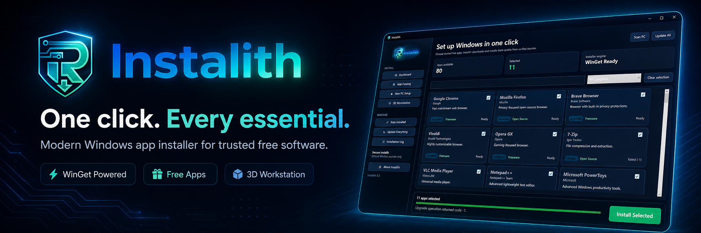
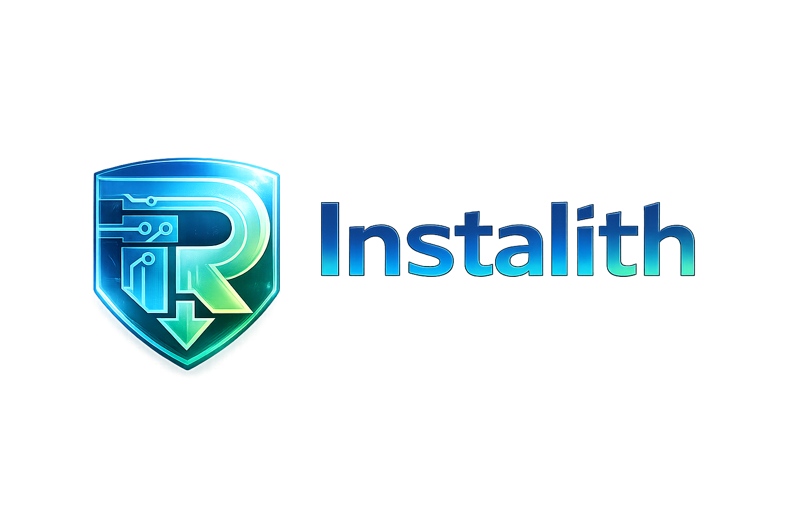

<div align="center">



<br>

# Instalith

### One click. Every essential.

A modern Windows application installer that helps you set up a fresh PC quickly using trusted, legitimate, and free software.

<br>

[](#system-requirements)
[](#system-requirements)
[](#technology)
[](#installation)
[](#how-it-works)
[](#project-status)

</div>

---

## What is Instalith?

**Instalith** is a clean, modern, one-click Windows software installer designed for new computers, fresh Windows installations, gaming PCs, office systems, developer workstations, content creators, and 3D-printing users.

Select the applications you want, click **Install Selected**, and Instalith handles the installation process through verified Windows package sources.

No PowerShell knowledge, command-line experience, Visual Studio, or separate development tools are required for regular users.

---

## Highlights

<table>
<tr>
<td width="50%">

### One-click installation

Select several applications and install them together from one simple interface.

</td>
<td width="50%">

### Modern Windows interface

A polished dark dashboard with application cards, search, filtering, presets, and installation progress.

</td>
</tr>
<tr>
<td width="50%">

### Free software catalog

Focused on legitimate free, open-source, freeware, and free personal-use applications.

</td>
<td width="50%">

### Built for fresh Windows setups

Quick presets help users prepare a new PC without visiting dozens of download websites.

</td>
</tr>
<tr>
<td width="50%">

### 3D workstation support

Includes CAD, modelling, slicing, mesh repair, electronics, and 3D-printing software.

</td>
<td width="50%">

### Safe installation sources

Uses WinGet and approved publisher sources rather than unofficial download mirrors.

</td>
</tr>
</table>

---

---

## Main Features

- Install multiple Windows applications from one interface
- Searchable software catalog
- Category filters
- New PC Setup preset
- 3D Workstation preset
- Installed-application scanning
- Update-all functionality
- Installation progress and status messages
- Detailed installation log
- WinGet-powered package installation
- Automatic x64 Windows publishing
- Light and dark-ready branding
- Desktop and Start menu shortcuts
- Standard Windows uninstaller
- Self-contained Windows installer
- No PowerShell required for end users
- No separate .NET runtime required for the packaged release

---

## Software Categories

Instalith is designed to include trusted free applications across the following categories:

| Category | Examples |
|---|---|
| Browsers | Chrome, Firefox, Brave, Vivaldi, Opera |
| Communication | Discord, Signal, Telegram, WhatsApp, Zoom |
| Office | LibreOffice, ONLYOFFICE, Obsidian, Zotero |
| Media | VLC, Kodi, HandBrake, FFmpeg, MusicBee |
| Graphics | Blender, GIMP, Krita, Inkscape, Paint.NET |
| Audio and video | OBS Studio, Audacity, Kdenlive, Shotcut |
| Gaming | Steam, Epic Games Launcher, GOG Galaxy, Xbox |
| Development | VS Code, Git, Python, Node.js, .NET SDK |
| Utilities | 7-Zip, PowerToys, Rufus, HWiNFO, WizTree |
| Security | Bitwarden, KeePassXC, VeraCrypt, WireGuard |
| 3D design | FreeCAD, OpenSCAD, Blender, SolveSpace |
| 3D printing | Bambu Studio, OrcaSlicer, PrusaSlicer, Cura |

---

## Free 3D Design and Printing

Instalith includes a dedicated collection for makers, designers, hobbyists, and 3D-printing businesses.

### CAD and modelling

- Blender
- FreeCAD
- OpenSCAD
- SolveSpace
- LibreCAD
- MeshLab
- Wings 3D
- CloudCompare

### Slicers

- Bambu Studio
- OrcaSlicer
- PrusaSlicer
- Ultimaker Cura
- SuperSlicer
- ideaMaker
- CHITUBOX Basic
- Lychee Slicer Free

### Electronics and maker tools

- KiCad
- Arduino IDE
- PlatformIO
- Raspberry Pi Imager
- BalenaEtcher
- LibrePCB

### Autodesk Fusion

Instalith may include **Autodesk Fusion for Personal Use** as an optional package.

Fusion Personal Use is intended only for qualifying home-based, non-commercial users and may have feature, account, revenue, or licensing restrictions. Instalith does not present it as unrestricted open-source or commercial-use software.

---

## How it works

```text
1. Open Instalith
2. Browse or search the application catalog
3. Select the applications you need
4. Click Install Selected
5. Instalith starts the approved WinGet package installations
6. Review progress and installation results
```

Instalith does not bundle cracked software, activation tools, modified installers, or unauthorized licence keys.

---

## Installation

### For regular users

Download:

```text
Instalith-Setup.exe
```

Then:

1. Double-click the installer
2. Approve the Windows administrator prompt
3. Choose whether to create a desktop shortcut
4. Finish installation
5. Launch Instalith

The setup package installs the required application files, creates shortcuts, and registers the Windows uninstaller.

### Uninstalling

Instalith can be removed through:

```text
Windows Settings → Apps → Installed apps → Instalith → Uninstall
```

or from the Instalith Start menu folder.

---

## Portable build

The project can also generate a portable application folder:

```text
release/
└── Instalith-win-x64/
    ├── Instalith.exe
    ├── Instalith.pdb
    └── Data/
```

For normal distribution, share **Instalith-Setup.exe** rather than individual files from the portable folder.

---

## Building from source

### Requirements

- Windows 10 or Windows 11
- .NET SDK 8 or newer
- Inno Setup 6 or 7
- WinGet available on the build/test computer

### Build the complete installer

Open Command Prompt inside the project and run:

```cmd
build\Build-Installer.cmd
```

The build process:

1. Publishes the self-contained Windows application
2. Creates the `Instalith-win-x64` release folder
3. Compiles the Inno Setup script
4. Creates the final installer

Output:

```text
release\Instalith-Setup.exe
```

### Build the application manually

```cmd
dotnet publish src\Instalith.App\Instalith.App.csproj ^
  -c Release ^
  -r win-x64 ^
  --self-contained true ^
  -p:PublishSingleFile=true ^
  -p:IncludeNativeLibrariesForSelfExtract=true ^
  -o release\Instalith-win-x64
```

### Compile the Inno Setup installer manually

```cmd
"C:\Program Files\Inno Setup 7\ISCC.exe" installer\Instalith.iss
```

---

## Project structure

```text
Instalith/
├── .github/
│   └── workflows/
├── assets/
├── build/
│   └── Build-Installer.cmd
├── docs/
├── installer/
│   └── Instalith.iss
├── release/
├── src/
│   └── Instalith.App/
├── Instalith.sln
└── README.md
```

---

## Technology

- **C#**
- **.NET 8**
- **WPF**
- **WinGet**
- **Inno Setup**
- **Windows x64 self-contained publishing**

---

## Security and software policy

Instalith is intended to install only legitimate software from approved sources.

The project does not support:

- Pirated software
- Cracked applications
- Activation bypasses
- Key generators
- Shared commercial licence keys
- Unofficial repackaged installers
- Deceptive software bundles
- Unauthorized mirrors

Applications with personal-use, educational, account, or commercial restrictions should be clearly labelled.

---

## Current release

### Instalith 0.3

Current functionality includes:

- Modern dark dashboard
- Searchable application catalog
- Approximately 80 initial package entries
- WinGet package installation
- New PC Setup preset
- 3D Workstation preset
- Installation logs
- Improved WinGet detection
- Self-contained Windows publishing
- Inno Setup installer
- Windows uninstall support

---

## Project status

Instalith is under active development.

Some package entries, installation IDs, licence terms, and publisher sources may change. Every package should be reviewed before being marked as verified.

Planned improvements include:

- Larger verified application catalog
- Better installed-version detection
- Per-application update status
- Improved download and installation progress
- Application icons
- Light theme
- Offline installation profiles
- Custom presets
- Automatic catalog updates
- Digital code signing
- Enhanced error reporting

---

## Contributing

Bug reports, package corrections, application requests, and feature suggestions are welcome.

When requesting a new application, include:

```text
Application name:
Official website:
WinGet package ID:
Licence type:
Free for personal use:
Free for commercial use:
Account required:
```

---

## Important notice

Instalith is an independent project and is not affiliated with Microsoft, WinGet, Ninite, Autodesk, Blender Foundation, or the publishers of applications listed in its catalog.

All trademarks and product names belong to their respective owners.

---

<div align="center">

## Instalith

### Set up Windows without the hassle.

**One click. Every essential.**

</div>
